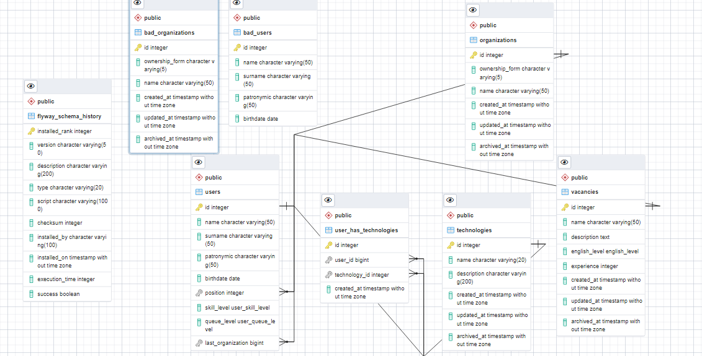

# bts_project 
It's a recruting project with difrent logics and user sorting when they register. See more in the task.pdf
A schema of a database:

Using technologies:
- spring-boot, 3 level architecture
- multi module maven project
- flyway
- lombok
- data validation
- jpa/hibernate
- postgres  db
- swagger, go to http://localhost:8087/swagger-ui/index.html#/
- second level cache Hibernate for directories
